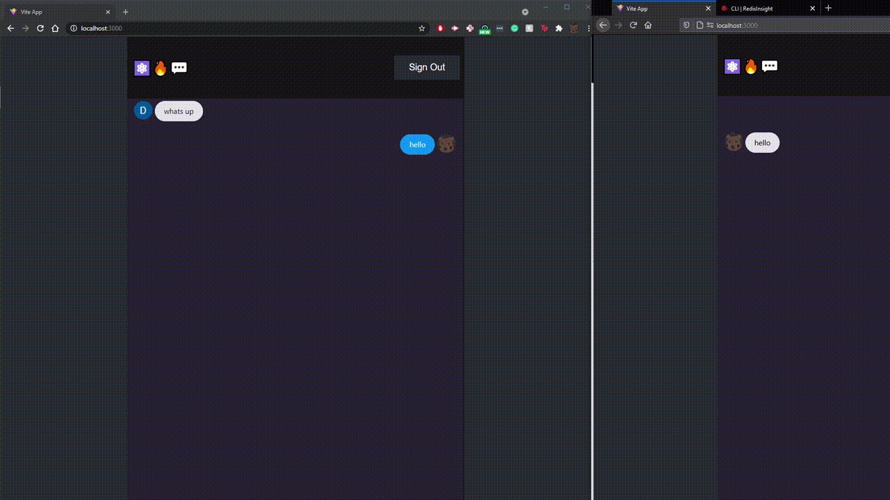
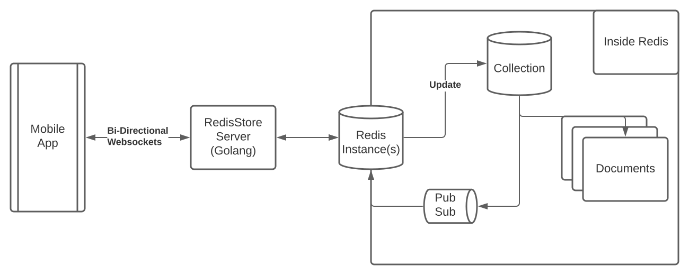

# RedisStore

An self hosted realtime JSON document store that gives you the same functionality as Firebase's Firestore with
none of the costs!

Requires RedisJSON

[Realtime Multichat Demo](https://redis-chat-hackathon-app.web.app/)


## Why we exists

It's right there at the top. Firebase's Firestore is an astonishingly easy to use JSON document store that allows developers to build real time applications WITHOUT going to the trouble of writing server side code. Firestore gives developers the ability to build real time apps at scale with just CLIENT-SIDE-CODE 🥳.

As long as you can afford it. If only there was a way to use Firestore without racking up a $30,000 bill [overnight](https://medium.com/madhash/how-not-to-get-a-30k-bill-from-firebase-37a6cb3abaca) 🤔.

Introducing 🎉RedisStore🎉!
(better name pending😖)

With RedisStore you have a drag in drop replacement for firestore. Set up your own redis instance anywhere (check out redis enterprise's [free tier](https://redislabs.com/try-free/), they aren't paying us to say that 🤫 <sub>but we wouldn't mind if they did...</sub>) and run the Firestore server anywhere (Docker container included in the repo).

Once that little bit of setup is done 😅, you can just replace your Firestore code

```js
const firestore = firebase.firestore();
```

with Redisstore

```js
const firestore = redisbase.redisstore();
```

And you are off to the races 🏎️! You'll get all of Firestore's functionality plus:

- You can scale to what ever you want!
- You can run your entire stack locally OR on whatever cloud you want!
- You can inspect all of YOUR data with no hassels.

#### Everything is in your control!

## How to use

enter rdis-store-react and run `npm run dev`
You'll automatically connect to a world wide group chat!
You'll have to log in with your google account so be nice :)

# Architecture

Conceptually, things are pretty straight forward.

JSON `documents` are combined into independent `collections`. The collections don't really exists, but they make up the key to retrieve the document. Let's give an example.

When User A wants to upload a new JSON document, the redisstore server gives it a uuid adds it to bulk storage

`JSON.SET "<namespace>:collection:<collectionID>:<documentID>" . <uploadedDocument>`

- namespace: A simple way to segment the keybase even more than just by collections. Want to use the same collection name but have a prod,staging,and dev version of your database on the same redis instance(s)? Just set the namespace to "prod","staging", or "dev".
- collectionID: user defined collection name. You can have a "messages" collection or a "dogs" collection or a "user" collection. You can have whatever collection you want and have full `realtime` access to that collection.
- documentID: the combination of namespace,collectionID,and documentID is a unique in your redisstore redis instance. You don't have to set the documentID (it's created for you), but if you want to override an existing document, that would be the way to do it.

Once that's set we mark the last updated time of that document in a [ZSet](https://redislabs.com/ebook/part-1-getting-started/chapter-1-getting-to-know-redis/1-2-what-redis-data-structures-look-like/1-2-5-sorted-sets-in-redis/)

`ZADD <namespace>:collection:<collectionID> <timestamp> <documentID>`

This let's us easily sort by latest updates (and lets clients easily filter updates)

Last but not least, we create the realtime functionality by publishing the addition.

`PUBLISH <namespace>:collection:<collectionID> add:<documentID>`

This lets anyone listening know that an update has been made to the collection.

On the other side of the world...

User B has had his app idle for a while, but redisstore is always ready to send updates to him through websockets. When User B tries to listen to a collection, redisstore calls

`SUBSCRIBE <namespace>:collection:<collectionID>`

It parses through those messages for the ones User B really wanted to subscribe to. Once it registers User A's addition it calls

`JSON.GET "<namespace>:collection:<collectionID>:<documentID>" .`

to return the document to the user.

## Redis Commands used

Quick summary of all the redis commands used.

- JSON.SET: creates/updates json document
- ZADD: keeps track of updates
- PUBLISH: publishes realtime updates
- SUBSCRIBE: gets realtime updates
- JSON.GET: gets json document
- ZRANGE: lists updates in order (in case the user wants everything)

## Architecture Diagram


